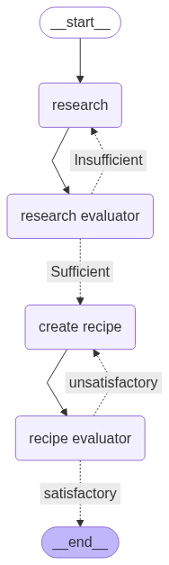

# Cooked #
## Demo ##
See a demo of cooked [here](https://youtu.be/glYORx7eY40)


## Introduction ##
Would you ask an AI to generate a recipe for you? I personally hesistate, as I would rather not have an AI hallucinate the recipe.

Cooked is an AI-powered recipe generator that uses a multi-step, agentic workflow to generate high-quality recipes. 

It collects real-time online sources, evaluates the quality of information, and produces a structured recipe with detailed instructions, ingredient quantities, and references.

This is what cooked looks like behind the hood:



## Installation ##
1. Clone this repo
2. Install dependencies

- Frontend 
    ```bash
    cd frontend
    cd frontend
    npm install
    ```

- Backend

    From your root directory
    ```bash
    cd backend
    python3 -m venv venv
    source venv/bin/activate
    pip install -r requirements.txt
    ```

3. Add private keys to a ```.env``` file in ```/backend```

4. Run the frontend
    ```bash
    cd frontend
    cd frontend
    npm run dev
    ```